## Ex-08-Data-Visualization-

## Aim:
To Perform Data Visualization on a complex dataset and save the data to a file. 

## Explanation:
Data visualization is the graphical representation of information and data. By using visual elements like charts, graphs, and maps, data visualization tools provide an accessible way to see and understand trends, outliers, and patterns in data.

## Algorithm:
## STEP 1
Read the given Data
## STEP 2
Clean the Data Set using Data Cleaning Process
## STEP 3
Apply Feature generation and selection techniques to all the features of the data set
## STEP 4
Apply data visualization techniques to identify the patterns of the data.


# Code:
```
PROGRAM DEVELOPED BY :PAVIZHI.B

REGISTER NUMBER : 212221230077

import pandas as pd
import numpy as np
import matplotlib.pyplot as plt
import seaborn as sns

df=pd.read_csv("Superstore.csv", encoding='windows-1252')
df

df.head()
```
## 1.Line plot
```
plt.figure(figsize=(8,5))
sns.lineplot(x="Segment",y="Region",data=df,marker='o')
plt.xticks(rotation = 90)
sns.lineplot(x='Ship Mode',y='Category', hue ="Segment",data=df)
sns.lineplot(x="Category",y="Sales",data=df,marker='o')
```
## 2.Scatterplot
```
sns.scatterplot(x='Category',y='Sub-Category',data=df)
sns.scatterplot(x='Category', y='Sub-Category', hue ="Segment",data=df)
plt.figure(figsize=(10,7))
sns.scatterplot(x="Region",y="Sales",data=df)
plt.xticks(rotation = 90)
```
## 3.Boxplot
```
sns.boxplot(x="Sub-Category",y="Discount",data=df)
sns.boxplot( x="Profit", y="Category",data=df)
```

## 4.Barplot
```
sns.barplot(x="Sub-Category",y="Sales",data=df)
plt.xticks(rotation = 90)
sns.barplot(x="Category",y="Sales",data=df)
plt.xticks(rotation = 90)
```
## 5.Pointplot
```
sns.pointplot(x=df["Quantity"],y=df["Discount"])
```
## 6.Count plot
```
sns.countplot(x="Category",data=df)
sns.countplot(x="Sub-Category",data=df)
```
## 7.Histogram
```
sns.histplot(data=df,x ='Ship Mode',hue='Sub-Category')
```
## 8.KDE Plot
```
sns.kdeplot(x="Profit", data = df,hue='Category')
```
## Data Visualization Using MatPlotlib


## 1.Plot
```
plt.plot(df['Category'], df['Sales'])
plt.show()
```
## 2.Heatmap
```
df.corr()
plt.subplots(figsize=(12,7))
sns.heatmap(df.corr(),annot=True)
```
## 3.Piechart
```
df1=df.groupby(by=["Ship Mode"]).sum()
labels=[]
for i in df1.index:
    labels.append(i)
colors=sns.color_palette("bright")
plt.pie(df1["Sales"],labels=labels,autopct="%0.0f%%")
plt.show()

df3=df.groupby(by=["Category"]).sum()
labels=[]
for i in df3.index:
    labels.append(i) 
plt.figure(figsize=(8,8))
colors = sns.color_palette('pastel')
plt.pie(df3["Profit"],colors = colors,labels=labels, autopct = '%0.0f%%')
plt.show()
```
## 4.Histogram
```
plt.hist(df["Sub-Category"],facecolor="peru",edgecolor="blue",bins=10)
plt.show()

```
## 5.Bargraph
```
plt.bar(df.index,df['Category'])
plt.show()
```
## 6.Scatterplot
```
plt.scatter(df["Region"],df["Profit"], c ="blue")
plt.show()  
```
## 7.Boxplot
```
plt.boxplot(x="Sales",data=df)
plt.show()
```

## Output:
## df
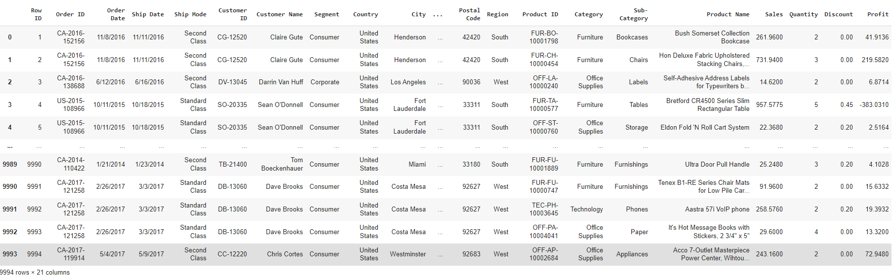
## df.head
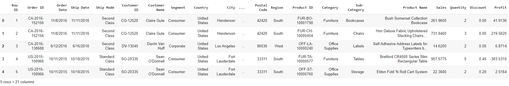
## Line plot:

## Scatter plot:
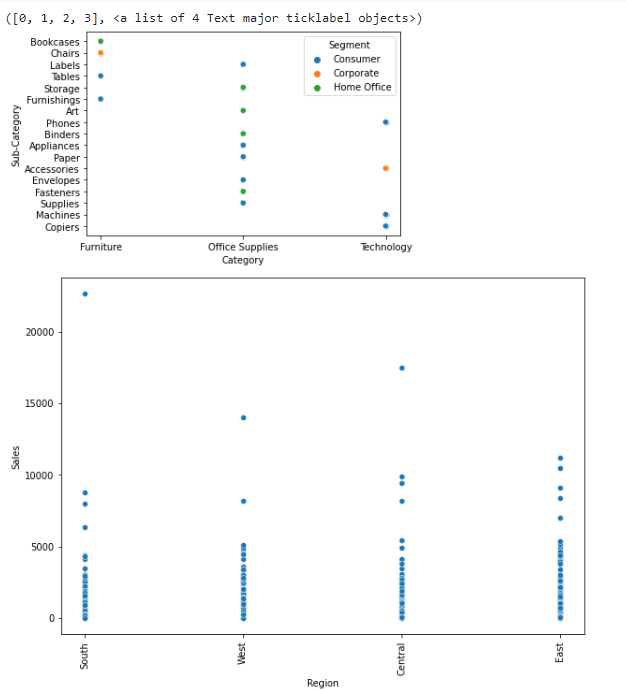

## Box plot:
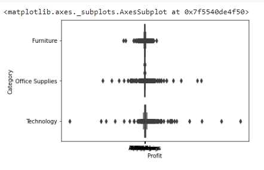
## Bar plot:
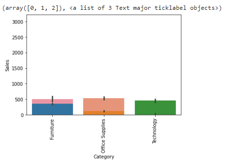
## Point plot:
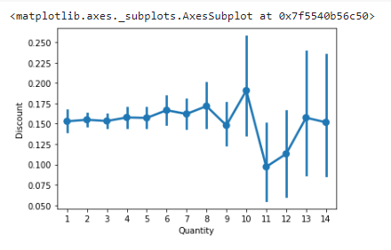
## Count plot:
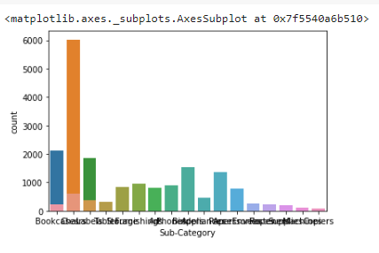
## Histogram:
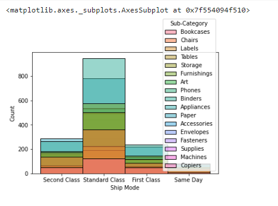
## KDE plot:
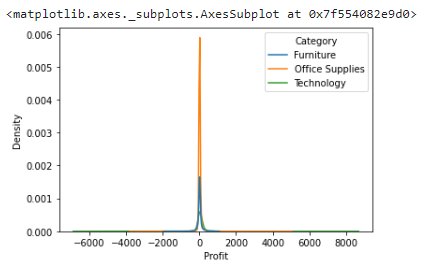
## Data Visualization Using MatPlotlib

## 1.Plot
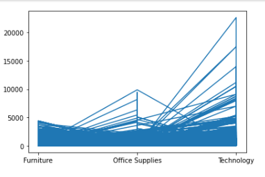
## 2.Heatmap
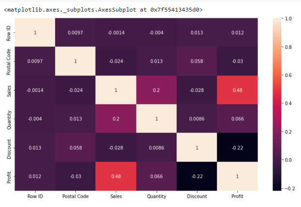
## 3.Piechart
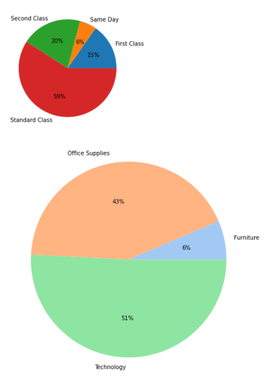
## 4.Histogram
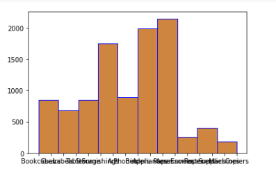
## 5.Bargraph
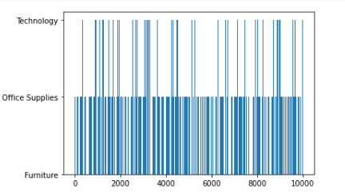
## 6.Scatterplot
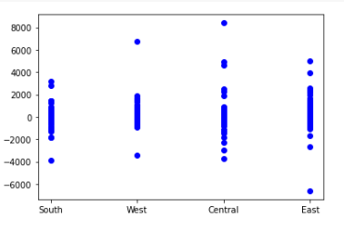
## 7.Boxplot
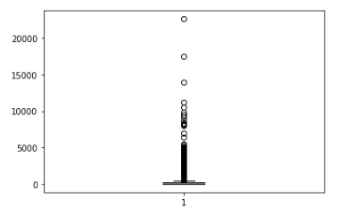
## Result:
Hence, Data Visualization is applied on the complex dataset using libraries like Seaborn and Matplotlib successfully and the data is saved to file.
